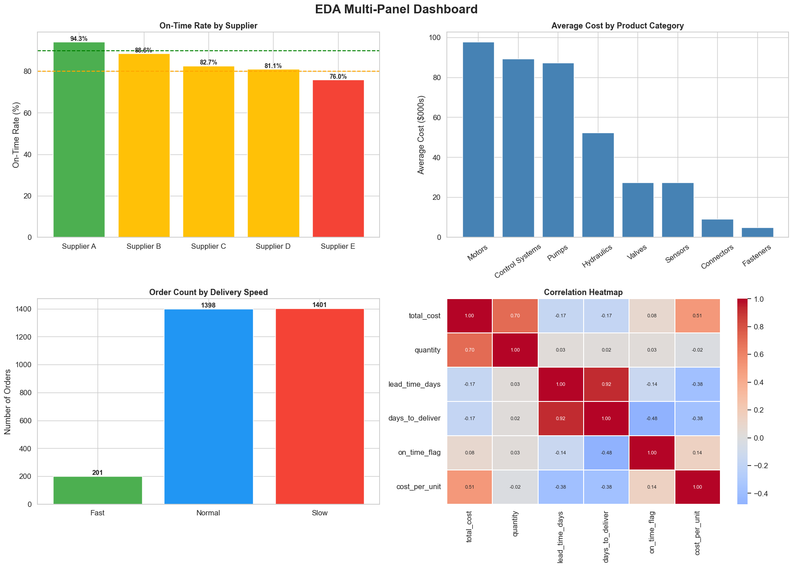

# Supply chain data-quality and cost analysis

**Question:** What can a procurement analyst responsibly conclude when an order export has incomplete dates and inconsistent values?

This reproducible Python case study audits **3,000 simulated orders**. The file supplied as `cleaned_supply_chain_dataset.csv` is incomplete: **2,683 order dates** and **296 delivery dates** are missing. The revised notebook focuses on data quality and recorded cost by category, areas supported by the available data. Earlier monthly and delivery-speed charts are retained in `archive/` for provenance but are not presented as validated results.

## Original dashboard screenshot

- [Open the original supply chain dashboard screenshot](images/original-supply-chain-dashboard.png) — the image used on the portfolio website.
- [Open the source-verified data-quality chart](images/data-quality-overview.png).

The original screenshot is preserved as created. Its monthly and delivery-time views need complete dates before they can be reproduced; the verified chart below addresses the available data.

## Verified findings

| Check | Result | Implication |
| --- | ---: | --- |
| Missing order dates | 2,683 / 3,000 (89.4%) | Monthly order trends cannot be reliably reproduced |
| Missing delivery dates | 296 / 3,000 (9.9%) | Exclude or recover source records before timing analysis |
| Recorded cost differs from quantity × unit price by >0.02 | 154 rows (5.1%) | Validate discounts, adjustments or input errors before using a calculated margin |
| Recorded cost attributed to Motors | 66,671,196 dataset units (39.2% of total) | Investigate category concentration; currency is unspecified |

Supplier spellings also vary (`Suppliera` and `Supplier A`, for example); the notebook standardises these in a working column. Cost comparisons describe the simulated dataset and are not evidence of a real company's procurement savings.

## Reproduce

Run `supply-chain-eda.ipynb` from this repository's root in Jupyter or VS Code. It requires Python, pandas and a notebook environment. The file `images/data-quality-overview.png` is a static summary of the source CSV. Do not use the older time charts until a complete raw export is available.

## Files

- [`supply-chain-eda.ipynb`](supply-chain-eda.ipynb): reproducible quality and cost analysis.
- [`cleaned_supply_chain_dataset.csv`](cleaned_supply_chain_dataset.csv): provided simulated data; its filename does not imply that dates are complete.
- [`images/data-quality-overview.png`](images/data-quality-overview.png): current verified summary.
- [`images/original-supply-chain-dashboard.png`](images/original-supply-chain-dashboard.png): original dashboard screenshot.
- [`archive/original-eda-notebook.ipynb`](archive/original-eda-notebook.ipynb) and `archive/legacy-visuals/`: previous analysis retained for traceability; it referenced a raw CSV not supplied here.

**Analyst:** [Chukwuemeka Ogo](https://mikkymo.github.io/portfolio/) · [LinkedIn](https://www.linkedin.com/in/ogochukwuemeka/)
